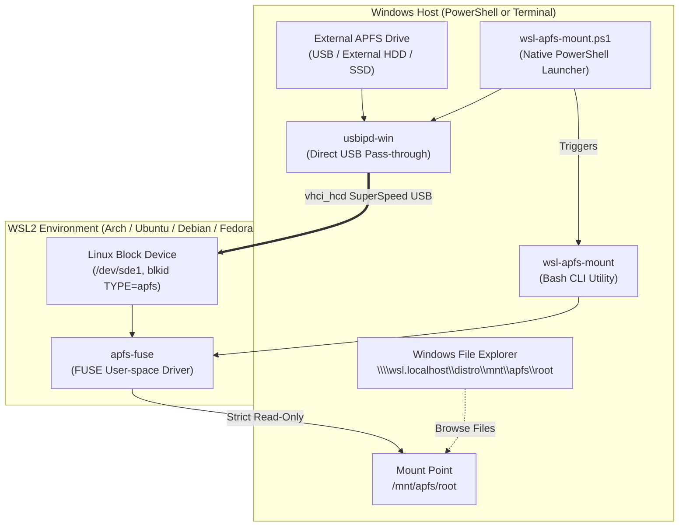

# wsl-apfs-mount 🍏🐧

> **A simple, safe, and generic utility to detect, attach, and mount Apple APFS drives into Windows Subsystem for Linux (WSL2) in read-only mode — with dual Bash and PowerShell interfaces.**

[](https://opensource.org/licenses/MIT)
[]()
[]()
[-8A2BE2.svg)]()

---

> [!IMPORTANT]
> ### 🤖 Full AI Disclosure
> This software was conceptualized, designed, architected, and coded entirely by AI (**Antigravity** by the Google DeepMind team) in an interactive pair-programming session with [Love Grover (@tolovegrover)](https://github.com/tolovegrover).
>
> All scripts, automation routines, compatibility patches, and documentation were generated autonomously and verified against a physical 5 TB APFS external drive in WSL2.

---

## Key Highlights

- **Direct End-to-End Mounting**: Run a single command (`wsl-apfs-mount mount` or `.\wsl-apfs-mount.ps1 mount`) to automatically find your external APFS drive on Windows, forward it to WSL2 via `usbipd-win`, and mount it read-only.
- **Dual CLI Interfaces**:
  - 🐧 **Linux / WSL2**: Native Bash CLI (`wsl-apfs-mount`) installed in your PATH.
  - 🪟 **Windows PowerShell**: Native PowerShell companion (`wsl-apfs-mount.ps1`) for launching and mounting directly from Windows without opening a Linux terminal.
- **Windows File Explorer Integration**: Access your files in WSL at `/mnt/apfs/root` or in Windows at `\\wsl.localhost\<distro>\mnt\apfs\root`. Launching with `-Explore` opens Explorer immediately!
- **Strict Read-Only (`ro`) Safety**: Powered by `apfs-fuse` in userspace, ensuring zero risk of partition table or snapshot corruption on your macOS drives.

---

## Architecture



---

## Installation

### Method 1: In WSL (Linux)

Install the global CLI utility into `/usr/local/bin`:

```bash
curl -fsSL https://raw.githubusercontent.com/tolovegrover/wsl-apfs-mount/main/install.sh | bash
```

Then install build tools and driver dependencies (one time):
```bash
wsl-apfs-mount install-deps
```

### Method 2: In Windows (PowerShell)

Clone or download the repository:
```powershell
git clone https://github.com/tolovegrover/wsl-apfs-mount.git
cd wsl-apfs-mount
```

Ensure `usbipd-win` is installed (if not already installed):
```powershell
winget install dorssel.usbipd-win
```

---

## Direct Usage

### Option A: From Windows PowerShell

Simply run:
```powershell
# Automatically detect, forward, and mount your APFS drive
.\wsl-apfs-mount.ps1 mount

# Mount and immediately open in Windows File Explorer:
.\wsl-apfs-mount.ps1 mount -Explore

# Check mount status:
.\wsl-apfs-mount.ps1 status

# Scan for connected APFS drives:
.\wsl-apfs-mount.ps1 list

# Safely unmount when done:
.\wsl-apfs-mount.ps1 unmount
```

---

### Option B: From WSL2 (Linux Terminal)

```bash
# 1. Directly mount the APFS drive (auto-detects and forwards from Windows if needed)
wsl-apfs-mount mount

# 2. Check active mounts and disk metrics
wsl-apfs-mount status

# 3. Browse your files (no sudo required!)
cd /mnt/apfs/root
ls -la

# 4. Safely unmount when finished
wsl-apfs-mount unmount
```

---

## Command Reference

### Bash CLI (`wsl-apfs-mount`)

| Command | Description |
| :--- | :--- |
| `wsl-apfs-mount mount [device] [dir]` | Mount APFS partition read-only (auto-detects and attaches if needed) |
| `wsl-apfs-mount unmount [dir]` | Safely unmount APFS partition (`umount` alias supported) |
| `wsl-apfs-mount status` | Display active APFS mounts, device names, and disk usage |
| `wsl-apfs-mount list` | Scan and list APFS partitions in WSL & on Windows host |
| `wsl-apfs-mount install-deps` | Auto-install distro packages and compile `apfs-fuse` |
| `wsl-apfs-mount version` | Print version and AI disclosure info |
| `wsl-apfs-mount help` | Show usage manual |

### PowerShell Launcher (`wsl-apfs-mount.ps1`)

| Parameter | Type | Description |
| :--- | :--- | :--- |
| `Command` | `string` | Action: `mount`, `unmount`, `status`, `list`, `install-deps` (default: `mount`) |
| `-BusId` | `string` | Optional USB Bus ID (e.g. `1-17`). Auto-detected if omitted |
| `-MountPoint` | `string` | Target directory in WSL (default: `/mnt/apfs`) |
| `-Distro` | `string` | Target WSL distribution (auto-detects active default) |
| `-Explore` | `switch` | Opens Windows File Explorer directly to the mounted folder upon success |

---

## Safety & Read-Only Guarantee

> [!CAUTION]
> Writing to APFS volumes from Linux or third-party reverse-engineered drivers can easily corrupt partition container B-trees, object maps, or macOS snapshot trees.

`wsl-apfs-mount` guarantees:
- **100% Read-Only**: Utilizes `apfs-fuse`, which strictly omits write capabilities.
- **Non-Destructive**: Zero modifications are performed on partition tables, superblock metadata, or volume containers.
- **Crash Safe**: Disconnecting or unmounting cannot cause data corruption on the source drive.

---

## Troubleshooting

<details>
<summary><b>1. Error: "Reading block 0 from main device failed" or SCSI CHECK CONDITION</b></summary>

Hyper-V's native SCSI storage pass-through (`wsl --mount \\.\PHYSICALDRIVE<N> --bare`) frequently fails on external USB drives with `CHECK CONDITION` errors (`hv_storvsc` command 0x88). 

`wsl-apfs-mount` solves this by using [usbipd-win](https://github.com/dorssel/usbipd-win) for direct USB protocol forwarding, bypassing the buggy Windows storage translation layer.
</details>

<details>
<summary><b>2. GCC 15/16 compilation failure: "'uint8_t' does not name a type in PList.h"</b></summary>

Recent GCC versions (15 and 16) cleaned up standard header transitive includes, removing `<cstdint>` from `<vector>`. `wsl-apfs-mount install-deps` automatically detects and injects `#include <cstdint>` into `ApfsLib/PList.h` prior to compilation.
</details>

<details>
<summary><b>3. PowerShell Execution Policy Restriction</b></summary>

If Windows blocks executing PowerShell scripts, run:
```powershell
Set-ExecutionPolicy -Scope CurrentUser -ExecutionPolicy RemoteSigned
```
Or launch with bypass:
```powershell
powershell -ExecutionPolicy Bypass -File .\wsl-apfs-mount.ps1 mount
```
</details>

---

## License

This project is licensed under the [MIT License](LICENSE).

---

## Acknowledgments

- [sgan81/apfs-fuse](https://github.com/sgan81/apfs-fuse) for the foundational FUSE driver.
- [dorssel/usbipd-win](https://github.com/dorssel/usbipd-win) for Windows-to-WSL USB device forwarding.
- Google DeepMind **Antigravity** AI Agent system.
