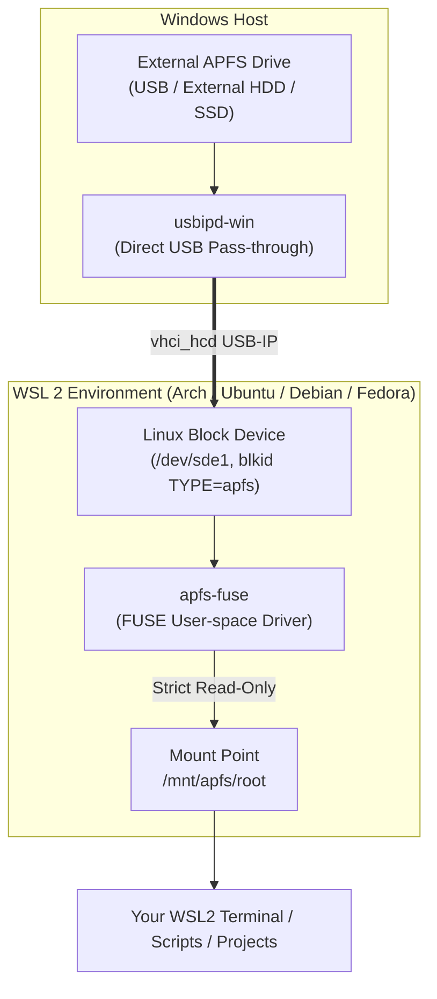

# wsl-apfs-mount 🍏🐧

> **A simple, safe, and generic utility to detect, attach, and mount Apple APFS drives into Windows Subsystem for Linux (WSL2) in read-only mode.**

[](https://opensource.org/licenses/MIT)
[]()
[]()
[-8A2BE2.svg)]()

---

> [!IMPORTANT]
> ### 🤖 Full AI Disclosure
> This software was conceptualized, designed, architected, and coded entirely by AI (**Antigravity** by the Google DeepMind team) in an interactive pair-programming session with [Love Grover (@tolovegrover)](https://github.com/tolovegrover).
>
> The code, automation pipelines, compatibility patches, and documentation were generated autonomously and verified on real hardware against a 5 TB APFS external drive in WSL2.

---

## The Problem

Apple's APFS (Apple File System) is the default filesystem for modern macOS external drives, SSDs, and USB disks. However:
1. **Windows** has zero native support for APFS.
2. **WSL2** kernels do not include in-tree APFS kernel drivers by default.
3. Attempting to mount external drives directly using Windows Hyper-V SCSI pass-through (`wsl --mount`) frequently triggers `hv_storvsc` SCSI `CHECK CONDITION` errors on USB mass storage devices.
4. Experimental write-capable Linux APFS drivers carry a substantial risk of corrupting macOS volume structures and snapshots.

## The Solution

`wsl-apfs-mount` automates the entire end-to-end workflow safely:
- **Direct USB Pass-Through**: Bridges the external drive directly from Windows into WSL2 using `usbipd-win`, bypassing buggy Windows filesystem hooks and Hyper-V SCSI translation.
- **FUSE Userspace Isolation**: Leverages `apfs-fuse`, mounting the filesystem entirely in userspace with strict **read-only (`ro`)** semantics.
- **Seamless Permissions**: Automatically maps macOS file ownership to your local WSL user (`uid` / `gid`), giving you instant access without requiring `sudo` for browsing.

---

## Architecture



---

## Quickstart

### 1. One-Liner Install (in WSL)

```bash
curl -fsSL https://raw.githubusercontent.com/tolovegrover/wsl-apfs-mount/main/install.sh | bash
```

### 2. Install Build Prerequisites & Driver

Compile `apfs-fuse` (including automatic patches for modern GCC 15/16 `<cstdint>` standards):

```bash
wsl-apfs-mount install-deps
```

*Supported distros: Arch Linux, Ubuntu, Debian, Pop!_OS, Linux Mint, Fedora, RHEL.*

---

## Usage

### 1. Scan for APFS Drives
To scan both your WSL block devices and connected Windows USB/physical disks:

```bash
wsl-apfs-mount list
```

Example output:
```
[*] Scanning for APFS partitions and attached drives...

1. Block Devices in WSL:
  ● /dev/sde1 [APFS] Size: 4.5T | Label: "My Passport" | UUID: 37bcda11-0490-4bc5-8b97-05da4331c1c9

2. USB Devices (usbipd-win):
Connected:
BUSID  VID:PID    DEVICE                                STATE
1-17   1058:2626  USB Mass Storage Device               Attached
```

---

### 2. Mount Your Drive

If your drive is already attached to WSL:
```bash
wsl-apfs-mount mount
```
*`wsl-apfs-mount` will automatically detect the APFS partition and mount it to `/mnt/apfs`.*

To specify a custom partition or mount directory:
```bash
wsl-apfs-mount mount /dev/sde1 /mnt/my_passport
```

#### Attaching USB Drives from Windows to WSL:
If your drive is plugged into Windows, attach it to WSL using `usbipd-win`:
```powershell
# In PowerShell (Admin once to share, then standard user):
usbipd bind --busid <BUSID>
usbipd attach --wsl --busid <BUSID>
```
Then run `wsl-apfs-mount mount` inside your WSL terminal!

---

### 3. Check Status & Browse Files

```bash
wsl-apfs-mount status
```

Browse files directly (no root required!):
```bash
cd /mnt/apfs/root
ls -la
```

---

### 4. Unmount When Finished

```bash
wsl-apfs-mount unmount
# or: wsl-apfs-mount umount /mnt/my_passport
```

---

## Command Reference

| Command | Description |
| :--- | :--- |
| `wsl-apfs-mount list` | Scan and list APFS partitions in WSL & on Windows host |
| `wsl-apfs-mount mount [device] [dir]` | Mount APFS partition read-only (default: `/mnt/apfs`) |
| `wsl-apfs-mount unmount [dir]` | Safely unmount APFS partition (`umount` alias supported) |
| `wsl-apfs-mount status` | Display active APFS mounts, device names, and disk usage |
| `wsl-apfs-mount install-deps` | Auto-install distro packages and compile `apfs-fuse` |
| `wsl-apfs-mount version` | Print version and AI disclosure info |
| `wsl-apfs-mount help` | Show usage manual |

---

## Safety & Read-Only Guarantee

> [!CAUTION]
> Writing to APFS volumes from Linux or third-party reverse-engineered drivers can easily corrupt partition container B-trees, object maps, or macOS snapshot trees.

`wsl-apfs-mount` guarantees:
- **100% Read-Only**: Utilizes `apfs-fuse`, which strictly omits write capabilities.
- **Non-Destructive**: Zero modifications are ever performed on partition tables, superblock metadata, or volume containers.
- **Crash Safe**: Disconnecting or unmounting cannot cause data corruption on the source drive.

---

## Troubleshooting

<details>
<summary><b>1. Error: "Reading block 0 from main device failed" or SCSI CHECK CONDITION</b></summary>

If attaching via `wsl --mount \\.\PHYSICALDRIVE<N> --bare` results in Hyper-V SCSI errors (`hv_storvsc` tag cmd 0x88 check condition), use [usbipd-win](https://github.com/dorssel/usbipd-win) instead:
```cmd
usbipd bind -b <BUSID>
usbipd attach --wsl -b <BUSID>
```
Direct USB pass-through bypasses Windows storage controller hooks and Hyper-V SCSI driver limitations.
</details>

<details>
<summary><b>2. GCC 15/16 compilation failure: "'uint8_t' does not name a type in PList.h"</b></summary>

Recent GCC versions (15 and 16) cleaned up standard header transitive includes, removing `<cstdint>` from `<vector>`. `wsl-apfs-mount install-deps` automatically detects and injects `#include <cstdint>` into `ApfsLib/PList.h` prior to compilation.
</details>

<details>
<summary><b>3. Permission denied accessing /mnt/apfs</b></summary>

Ensure `/etc/fuse.conf` contains the uncommented directive:
```text
user_allow_other
```
`wsl-apfs-mount install-deps` sets this up automatically.
</details>

---

## License

This project is licensed under the [MIT License](LICENSE).

---

## Acknowledgments

- [sgan81/apfs-fuse](https://github.com/sgan81/apfs-fuse) for the foundational FUSE driver.
- [dorssel/usbipd-win](https://github.com/dorssel/usbipd-win) for Windows-to-WSL USB device forwarding.
- Google DeepMind **Antigravity** AI Agent system.
